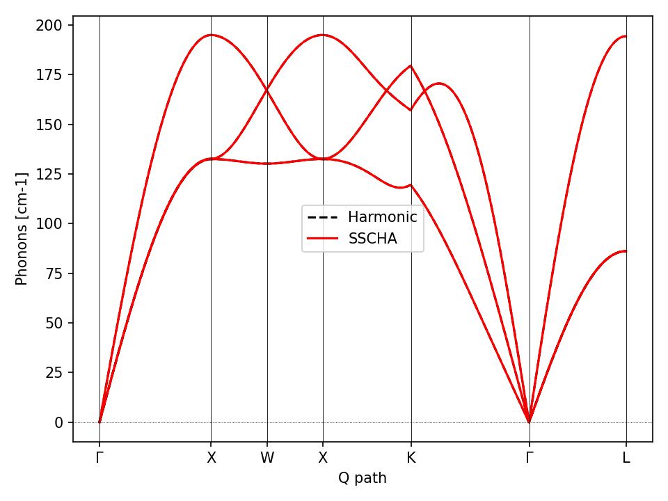
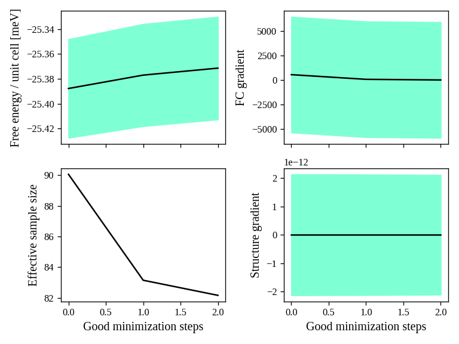
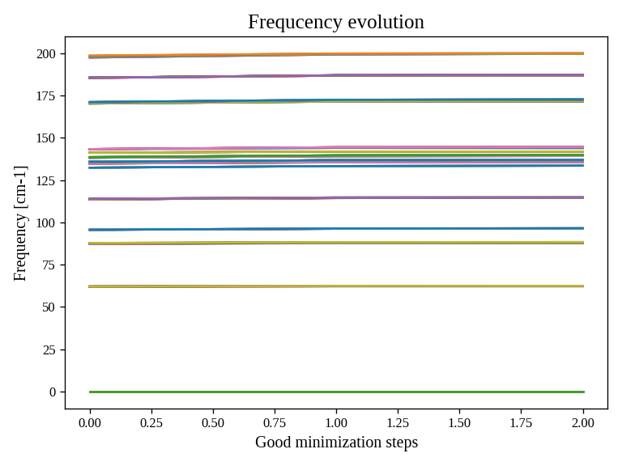
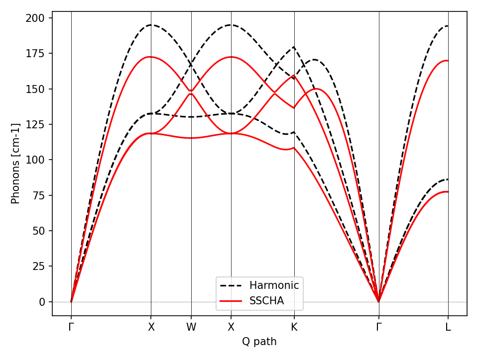
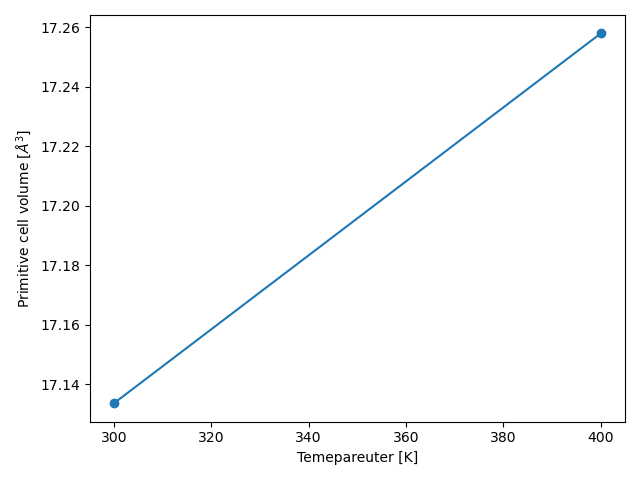

# SSCHA Tutorial

In this tutorial we will:

- Generate a Fcc structure file (cif) for silver (Ag).
- Harmonic phonons using a EMT force-field with ASE.
- Anharmonic self-consistent phonons for silver.
- Relax the unit-cell at fixed temperature.
- Thermal expansion.


## Generation of the structure of Silver.


We use the Atomic Simulation Environment (ASE) to build the cell of silver (FCC).

Run the file `create_structure.py` to generate the cif file of the Ag.
This should be the same as `Ag.cif` provided. 

## Exercize 1. Compute harmonic phonons.


Harmonic phonons can be evaluated within DFPT as illustrated in the previous tutorial.
Here we employ a different approach:

$$
\Phi_{ab}  = -\frac{d f_a}{d R_b}
$$

where $f_a$ is the force along the $a$ direction (encoding both the atom index and the Cartesian coordinate),
while $R_b$ is the position of the $b$ coordinate (encoding both the atom index and component). 

Exploiting symmetries, we can reduce the number of independent displacements to be evaluated.
In the case of Fcc lattice (Fm$\bar 3$m symmetry group), we have only 1 independent displacement.

We use cellconstructor to perform this calculation:

```python
import cellconstructor as CC, cellconstructor.Phonons

# Initialize the cellconstructor atomic structure
struct = CC.Structure.Structure()
struct.read_generic_file("Ag.cif")

ag_harmonic = CC.Phonons.compute_phonons_finite_displacements(
    struct,
    EMT(), 
    supercell=(4,4,4))
```

The function ``compute_phonons_finite_displacements`` takes as input the structure,
the ASE calculator (to compute the force on the structure), and the supercell on which 
to evaluate the dynamical matrix. The supercell is equivalent to the phonon q-mesh
employed in a DFPT calculation.

To impose the symmetries and the acoustic sum rule:

```python
ag_harmonic.Symmetrize()
```

To save the dynamical matrix in quantum espresso format:

```python
ag_harmonic.save_qe("AgDyn")
```

You find the complete script in `scripts/compute_harmonic_phonons.py`.

As in the quantum espresso format, the dynamical matrix generates many files (13 in this case), each one encoding the dynamical 
matrix of a separate star of q-points. The total number of q-points matches with the q-mesh (4x4x4 = 64), but only 13 of these are independent by symmetry.


## Exercize 2. Plot the phonon dispersion.

At the end of the harmonic calculation, you should have the harmonic dynamical matrix of silver.
You can plot the phonon dispersion editing the script `scripts/plot_dispersion.py`

There, you have the PATH in the Brilluin zone, the number of k points and the dynamical matrix.

```python
# Let us define the PATH in the brilluin zone and the total number of points
PATH = "GXWXKGL"
N_POINTS = 1000

# Here we define the position of the special points
SPECIAL_POINTS = {"G": [0,0,0],
             "X": [0, .5, .5],
             "L": [.5, .5, .5],
             "W": [.25, .75, .5],
             "K": [3/8., 3/4., 3/8.]}

# The two dynamical matrix to be compared
HARM_DYN = 'AgDyn'
SSCHA_DYN = 'relaxed_300_'

# The number of irreducible q points
# i.e., the number of files in which the phonons are stored
NQIRR = 13

```

This script is ment to compare the dispersion between two dynamical matrices whose name is 
in `HARM_DYN` and `SSCHA_DYN`. As a simple edit, pass to `SSCHA_DYN` the same file as `HARM_DYN`.



## Exercize 3. The SSCHA calculation.

After the harmonic calculation, we can start the SSCHA run.
This works similarly to the DFT self-consistent loop, but instead of optimizing the
electronic bands, we optimize the phonon bands self-consistently.

To run the SSCHA, we need a positive definite harmonic phonons. Ag should have
real harmonic phonons, so nothing to do, but if you simulate more complex materials that may not be the case.

To enforce the dynamical matrix to be positive definite, we use:

```python
dyn.ForcePositiveDefinite()
```

The sscha calculation needs the following steps:

- Generate a random ensemble of ionic displaced configurations according to the original dynamical matrix
- Evaluate forces and energies (end stress tensors) for each of the configuration generated.
- Run the free energy minimization to obtain the self-consistent dynamical matrix

### Ensemble generation

The ensemble generation is done with the module ``sscha.Ensemble.Ensemble``, you need to load the starting dynamical matrix and the temperature.


```python
import cellconstructor as CC, cellconstructor.Phonons
import sscha
import sscha.Ensemble, sscha.SchaMinimizer, sscha.Utilities

# Load the starting dynamical matrix
dyn = CC.Phonons.Phonons("AgDyn", nqirr=13)
TEMPERATURE=300 # Kelvin
N_CONFIGS = 100

# Generate the ensemble
ensemble = sscha.Ensemble.Ensemble(dyn, T0=TEMPERATURE)
ensemble.generate(N_CONFIGS)
```

### Compute forces and energies.

We use the EMT force field for silver, as we did for the harmonic calculation, to evaluate energies, forces and stress tensors of the configurations in the ensemble.

```python 
from ase.calculators.emt import EMT

# Compute energies forces and stress for the ensemble
ensemble.compute_ensemble(calculator = EMT(),
        compute_stress=True)
```

If you want to use DFT, you can either configure the ASE calculator for
quantum espresso (see [this link](https://wiki.fysik.dtu.dk/ase/ase/calculators/espresso.html), or configure a connection with a remote cluster to automatize the submission of all ensemble calculations (see [this tutorial](http://sscha.eu/Tutorials/tutorial_02_advanced_submission/) for more details).


### Submit the Free energy minimization (SSCHA)


We use the ensemble to start a free energy minimization. 
Here we optimize the auxiliary force constant matrix $\Phi$: 
both the phonon auxiliary frequencies (eigenvalues) and the
phonon polarization vectors (eigenvectors), as well as the
inner structure.
In this case, the inner structure is constrained by symmetries.

We initialize a `SSCHA_Minimizer` object that performs the minimization.
The `meaningful_factor` specifies the threshold below which the gradient must decrease before converging.

The `sscha.Utilities.IOInfo` provides a function to save the minimization status at each step on a file.

```python
# Run SSCHA
minim = sscha.SchaMinimizer.SSCHA_Minimizer(ensemble)
minim.meaningful_factor = 0.001

# Setup utilities
ioinfo = sscha.Utilities.IOInfo()
ioinfo.SetupSaving("minimization_300")

minim.init()
minim.run(custom_function_post=ioinfo.CFP_SaveAll)
minim.finalize()

minim.dyn.save_qe("final_sscha_300_")
```

The complete file tu run the minimization is: `script/my_first_sscha.py`. 
Run it with

```bash
$ python my_first_sscha.py > output.log
```

To plot the results, you can use:

```bash
$ sscha-plot-data.py minimization_300
```

This plots the two files: 
- `minimization_300.dat` containing the free energy, the gradient with respect to the force-constant matrix $\Phi$ and the structure, and the effective size of the ensemble.
- `minimization_300.freqs` containing the eigenvalues of the force-constant matrix (the energy of the auxiliary phonons) as a function of the minimization step.






Silver is highly harmonic, so we converge in only two steps. 
Looking at the `output.log` file, we can see the results:

```
 * * * * * * * * 
 *             * 
 *   RESULTS   * 
 *             * 
 * * * * * * * * 


Minimization ended after 17 steps

Free energy =     -25.37070369 +-       0.08242688 meV
FC gradient modulus =       2.67186660 +-   11782.88016138 bohr^2
Struct gradient modulus =       0.00000000 +-       0.00000000 meV/A
Kong-Liu effective sample size =  82.13403803013847

Total force on the centroids [eV/A]:
   0)      -0.000000     -0.000000     -0.000000  +-       0.000000      0.000000     -0.000000


 ==== STRESS TENSOR [GPa] ==== 
      7.13068431      0.00000000     -0.00000000                0.01957028      0.00000000      0.00000000
     -0.00000000      7.13068431      0.00000000    +-          0.00000000      0.01957028      0.00000000
      0.00000000      0.00000000      7.17588426                0.00000000      0.00000000      0.02918424


```

We see the free energy with the stochastic error, this value is used for phase-transition.
**Fixed the temperature and volume, the phase with lowest free energy is the ground state (the stable phase).**

Then we have the gradients of the force constants and the structure (FC = gradient of force constant $\Phi$).

Then the Kong-Liu effective sample size. This value indicates how good it is the ensemble to describe the self-consistent $\Phi$ and centroids. Usually, this should be above 0.5 the number of original configurations (in this case 100). 

Then we have the final force on the centroids, in this case it is zero because the atomic positions are fixed by symmetry.

Then there is the stress tensor. This includes the effect of temperature and quantum fluctuations, so it is different from the one given by quantum-espresso at the end of a self-consistent calculation.

In this case, the pressure is about 7 GPa, which is not ambient pressure, so we must relax the cell accounting for thermal effects.

### Exercize: Plot the dispersion of the SSCHA matrix and compare it with the harmonic one

Modify the `plot_dispersion.py` script.

## Cell relaxation with quantum and thermal fluctuations

To relax the cell and reach ambient pressure, we perform a vc-relax within the SSCHA.

You find the script to run the variable cell relaxation inside `scripts/vc_relax_with_temperature.py`.

Here you setup the temperature at the beginning. There are only three commands different from the standard SSCHA:

```python

# setup the automatic relax
relax = sscha.Relax.SSCHA(
        minim,
        ase_calculator = EMT(),
        N_configs=N_CONFIGS,
        max_pop=3)

relax.setup_custom_functions(custom_function_post=ioinfo.CFP_SaveAll)

relax.vc_relax(target_press=0,  # GPa
        static_bulk_modulus=100)
```

We generate the `SSCHA` object, which allows to automatically resubmit a new ensemble
after each relaxation ends, updating the cell volume to minimize the *Gibbs Free Energy* $G$.

$$
G(P, T) = F(V, T) + PV
$$

We specify the target pressure $P$ as `target_press` keyword of `vc_relax` in GPa. We can also pass
the Bulk Modulus (also in GPa), which determines the optimal step of the cell relaxation.
The optimization algorithm will adapt the cell step automatically, so in the end it does not matter, but starting with a good value of the bulk modulus can speedup the convergence. 


The `max_pop` parameter specified when we setup the `SSCHA` object indicates the maximum number of iterations to do. If we start from something that was vc-relaxed with quantum espresso, we usually require less than five iterations, however, for strongly anharmonic systems with few symmetries it may take much more (as 20 iterations or more).


The full script looks like:

```python
from ase.calculators.emt import EMT

import cellconstructor as CC, cellconstructor.Phonons
import sscha
import sscha.Ensemble, sscha.SchaMinimizer, sscha.Utilities
import sscha.Relax

TEMPERATURE=300
N_CONFIGS=100

dyn = CC.Phonons.Phonons("relaxed_300_", nqirr=13)

# Impose all phonons to be real
dyn.ForcePositiveDefinite()

# Generate the ensemble
ensemble = sscha.Ensemble.Ensemble(dyn, T0=TEMPERATURE)

minim = sscha.SchaMinimizer.SSCHA_Minimizer(ensemble)
minim.meaningful_factor = 0.001

# Setup utilities
ioinfo = sscha.Utilities.IOInfo()
ioinfo.SetupSaving("minimization_300")

# setup the automatic relax
relax = sscha.Relax.SSCHA(
        minim,
        ase_calculator = EMT(),
        N_configs=N_CONFIGS,
        max_pop=4)

relax.setup_custom_functions(custom_function_post=ioinfo.CFP_SaveAll)

relax.vc_relax(target_press=0,  # GPa
        static_bulk_modulus=100)

relax.minim.dyn.save_qe("relaxed_300_")
```

```bash
$ python vc_relax_with_temperature.py > output_vc_300.log
```

While the minimization is running, you can probe the stress tensor with

```bash
$ grep TENSOR -A3 output_vc_300.log
```

In this way, you will see the stress tensor at the end of each population (free energy minimization)


### Exercize: Plot the minimization data. How did the frequencies change?

Plot also the comparison between the harmonic dynamical matrix and the self-consistent dynamical matrix after the vc-relax.



## Volumetric thermal expansion

Now adapt the script to submit the vc-relax calculation, and change the temperature to 400 K.
Submit a new vc-relax at the new temperature and compare the volumes of the final dynamical matrices.

It is convenient to start the vc-relax at 400 K from the value converged at 300 K. You can decrease to 3 the number of total steps since we are much closer to the final value. **Remember to change also the final file on which the dynamical matrix is saved.**


To extract the volume from the dynamical matrix:

```python
import cellconstructor as CC, cellconstructor.Phonons

# Load the dynamical matrix
dyn = CC.Phonons.Phonons("my_dynamical_matrix", nqirr=13)

# Get the volume of the primitive cell in A^3
volume = dyn.structure.get_volume()

# Print the volume
print("The volume of the primitive cell is:", volume, "A^3")
```

You find a script that automatically plot the volume as a function of temperature in `scripts/plot_volume.py`




### Exercize: Run the thermal expansion to more temperature close to 0.

Check if the volume deviates from a straight line close to 0 K. These are the quantum fluctuations!

